# dw-kit

> An AI development workflow toolkit for teams using agentic IDEs (Claude Code, Cursor) — from idea to review-ready commits.

**v1.2** · `npm install -g dw-kit` · [Docs](docs/README.md) · [Get started](docs/get-started.md) · [Cheatsheet](docs/cheatsheet.md)

---

## What is dw-kit?

dw-kit helps your team run AI-assisted development with a **repeatable workflow** and clear checkpoints:

```
Initialize → Understand → Plan → Execute (TDD) → Verify → Close
```



## Workflow overview

`dw` runs a 6-phase process (all phases for `standard` and `thorough`):

Initialize → Understand → Plan (stops for approval) → Execute (TDD; 1 commit per subtask) → Verify (quality gates + review sign-off) → Close (handoff + archive when done).

### 6 phases (full workflow)
- **Initialize**: clarify task scope and set up the workspace + task docs.
- **Understand**: survey the codebase, dependencies, patterns, and test coverage (no implementation).
- **Plan**: design the solution and subtasks; **pause for your approval**.
- **Execute**: implement using **TDD**; each subtask produces a commit.
- **Verify**: run quality gates + review sign-off to ensure correctness and safety.
- **Close**: handoff notes, finalize progress, and archive when done.

It’s designed for collaboration (Dev / Tech Lead / QA / PM) and keeps work auditable via lightweight task docs.

---

## Install

```bash
npm install -g dw-kit
```

---

## Quick start

Setup dw in project directory:

```bash
dw init
```

Then in **Claude Code CLI**, run the full workflow:

```
/dw-flow your-task-or-anythings
```

---

Discover other skills:

```
/dw-prompt
/dw-thinking
...

```

---

## CLI commands

```bash
dw init                 # setup wizard / presets
dw validate             # validate .dw/config/dw.config.yml
dw doctor               # installation health check
dw upgrade              # update toolkit files (override-aware)
dw upgrade --check      # check for updates only
dw upgrade --dry-run    # preview changes
dw prompt               # build a well-structured task prompt (autocomplete + wizard)
dw prompt --text "..."  # non-interactive: structure a description directly
dw claude-vn-fix        # patch Claude CLI to fix Vietnamese IME (backup/restore)
```

`dw claude-vn-fix` patches the local Claude CLI bundle to fix Vietnamese IME input (DEL char `\x7f` issue). Includes auto-backup and rollback.

---

## Depth system

Pick a default depth for your project, then override per task when risk increases.

| Depth | Best for | Workflow |
|-------|----------|----------|
| `quick` | Solo dev, hotfix, familiar code | Understand → Execute → Close |
| `standard` | Small teams, new features | Full 6 phases |
| `thorough` | Risky changes (API/DB/security) | Full workflow + arch-review + test-plan |

Configured in `.dw/config/dw.config.yml`:

```yaml
workflow:
  default_depth: "standard"
```

---

## What gets added to your repo?

```
.dw/        # methodology, config, adapters, task docs
.claude/    # Claude Code: skills, hooks, agents, rules
CLAUDE.md   # project context for the agent
```

---

Maintainer: [huygdv](mailto:huygdv19@gmail.com)
